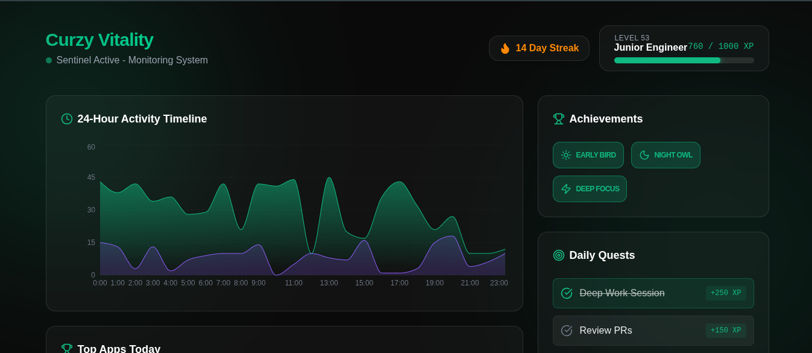
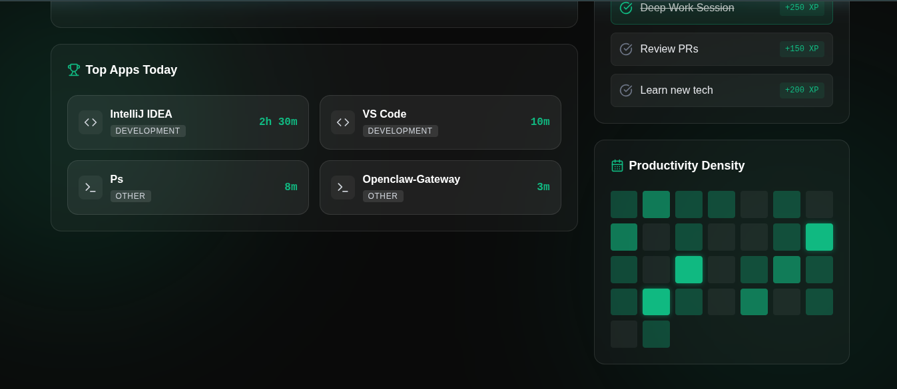

# Curzy Vitality v1.0.0
### A high-performance, gamified Life OS activity tracker.

Curzy Vitality is a modular system designed for developers and power users who want to monitor their productivity while maintaining wellness. By combining a silent background daemon (**Sentinel**) with a stunning, high-fidelity UI (**Nexus Dashboard**), it transforms raw system activity into actionable insights and RPG-like progression.

---

## 📸 Screenshots

| Top View | Bottom View |
| :---: | :---: |
|  |  |

---

## 🚀 Key Features

- **Sentinel (Daemon):** A lightweight Node.js service that monitors active applications using intelligent pattern-based (Regex) categorization.
- **Nexus Dashboard:** A premium, glassmorphic React interface featuring real-time data visualization via Recharts and Framer Motion.
- **Burnout Guard:** An active wellness monitor that triggers alerts after 3 hours of continuous deep work, suggesting vital breaks.
- **Gamification:** Earn XP for every second of productivity. Unlock unique badges like *Early Bird*, *Night Owl*, and *Deep Focus* based on your real-world behavior.
- **Smart Adaptive Mapping:** Automatically logs unknown processes to `logs/unknown_processes.log` for continuous system optimization.

---

## 🛠️ Tech Stack

- **Core:** Node.js (LTS)
- **Database:** SQLite3 (`better-sqlite3`) with WAL-mode for high concurrency.
- **Frontend:** React (Vite) + Tailwind CSS v4.
- **Visualization:** Recharts & Framer Motion.
- **Process Management:** PM2.
- **Icons:** Lucide-React.

---

## 📦 Installation & Quick Start

### Prerequisites
- Node.js installed on your system.
- PM2 installed globally: `npm install -g pm2`

### Setup
1. **Clone the repository:**
   ```bash
   git clone https://github.com/curzyori/Curzy-Vitality-3.git
   cd Curzy-Vitality-3
   ```

2. **Install dependencies:**
   ```bash
   npm install
   ```

3. **Launch with PM2 (Production):**
   Curzy Vitality uses an ecosystem configuration to manage both the backend and frontend simultaneously.
   ```bash
   pm2 start ecosystem.config.js
   ```

4. **Development Mode:**
   If you want to run the system with hot-reloading for both the Sentinel and the Dashboard, use the unified dev command:
   ```bash
   npm run dev
   ```

5. **Access the Dashboard:**
   Open your browser and navigate to `http://localhost:5173`.

---

## 📄 License & Copyright

**Copyright © 2026 Curzyori.**  
All rights reserved. Designed with passion for the "vibe coding" era.
